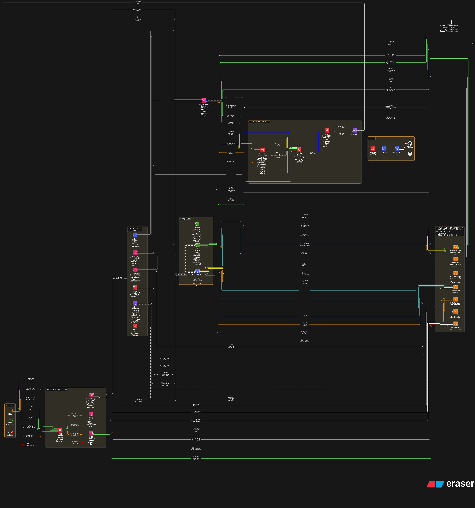

# Project 2: Cloud Media Archive Infrastructure

## Overview

This project involved designing and implementing a serverless cloud-based archival system for a media production company that produces 6 shows per week with episodes ranging from 2-6 hours in 4K resolution.

## Business Problem

The client faced critical storage and workflow challenges:
- **Massive file sizes:** Raw 4K footage generated ~300 GB per episode
- **Limited storage capacity:** Raw files were routinely deleted due to lack of space
- **No retention strategy:** Only final edited exports (13-17 GB) were kept
- **Re-editing challenges:** Unable to re-edit past content when only exports were available
- **Inefficient collaboration:** 3 editors working with external hard drives and SSDs
- **No structured retrieval:** No centralized system for finding and accessing archived content
- **Previous cloud failures:** Past attempts at cloud storage faced reliability issues

## Solution Architecture

Designed and implemented a fully serverless, scalable media archive solution using AWS services:

### Core Components
- **Amazon S3:** Multi-tier storage strategy (Hot, Warm, Cold, Deep Archive)
- **AWS Lambda:** Automated processing, metadata extraction, and lifecycle management
- **Amazon API Gateway:** RESTful API for upload/download operations
- **Amazon Cognito:** User authentication and role-based access control
- **Amazon DynamoDB:** Metadata storage and fast search capabilities
- **Amazon CloudFront:** Global content delivery for fast access
- **Route 53:** DNS management and routing
- **Amazon SNS:** Notifications for upload completion and system events
- **CloudWatch:** Monitoring, logging, and operational insights

### Key Features
- Direct internet-to-S3 ingestion for large files
- Intelligent storage tiering based on access patterns
- Metadata tagging for easy content retrieval
- Flexible user permissions (upload, edit, view-only)
- Cost optimization: pay for retrieval, not storage
- No physical infrastructure required

## My Responsibilities

- Architected the complete serverless solution
- Designed multi-tier storage strategy for cost optimization
- Implemented Lambda functions for automated processing
- Configured API Gateway for secure file operations
- Set up Cognito user pools and access control
- Designed DynamoDB schema for metadata management
- Implemented CloudFront distribution for content delivery
- Configured lifecycle policies for automated tiering
- Set up monitoring and alerting with CloudWatch and SNS
- Created documentation and user guides

## Technical Implementation

### Storage Strategy
- **Hot Tier (S3 Standard):** Recently uploaded content, frequent access
- **Warm Tier (S3 Infrequent Access):** Content accessed monthly
- **Cold Tier (S3 Glacier):** Long-term archive, rare access
- **Deep Archive (S3 Glacier Deep Archive):** Compliance and backup

### Automation
- Automated metadata extraction on upload
- Lifecycle policies for automatic tiering
- Event-driven processing with Lambda triggers
- Automated notifications for key events

### Security Considerations
- User authentication via Cognito
- Role-based access control (RBAC)
- Encrypted storage (S3 encryption at rest)
- Encrypted transit (HTTPS/TLS)
- API Gateway authorization
- CloudWatch audit logging
- Least privilege IAM policies

## Outcome / Results

- ✅ **Successfully ingested 5+ TB of media content** directly to cloud storage
- ✅ **Eliminated local storage limitations** - infinite scalable storage
- ✅ **Enabled raw file retention** - no more permanent deletions
- ✅ **Cost-effective solution** - tiered storage minimized ongoing costs
- ✅ **Fast retrieval** - CloudFront CDN for global access
- ✅ **Structured metadata** - easy search and discovery of archived content
- ✅ **Improved collaboration** - 3 editors with controlled access
- ✅ **Operational visibility** - monitoring and alerts for system health
- ✅ **No infrastructure management** - fully serverless solution

## Architecture Diagram

## Technical Challenges Overcome

1. **Large File Uploads:** Implemented multipart upload strategy for files over 100GB
2. **Cost Optimization:** Designed intelligent tiering to minimize storage costs while maintaining accessibility
3. **User Experience:** Created simple upload interface despite complex backend architecture
4. **Reliability:** Built in retry logic and error handling for network interruptions
5. **Metadata Management:** Automated extraction and indexing for fast retrieval

## Lessons Learned

- Serverless architectures excel for variable workloads and scale
- S3 storage classes can dramatically reduce costs for infrequently accessed data
- CloudFront significantly improves download speeds for global teams
- Proper IAM and Cognito configuration is critical for security
- Event-driven architectures simplify complex workflows
- Monitoring and logging are essential for production systems
- DynamoDB provides fast, scalable metadata search capabilities

## Technologies & AWS Services Used

**Compute & Processing:** AWS Lambda  
**Storage:** Amazon S3 (Standard, IA, Glacier, Glacier Deep Archive)  
**Database:** Amazon DynamoDB  
**Networking & Delivery:** Amazon CloudFront, Route 53, API Gateway  
**Security & Identity:** AWS Cognito, IAM  
**Monitoring & Notifications:** CloudWatch, SNS  
**Development:** Python, Boto3, AWS SDK
