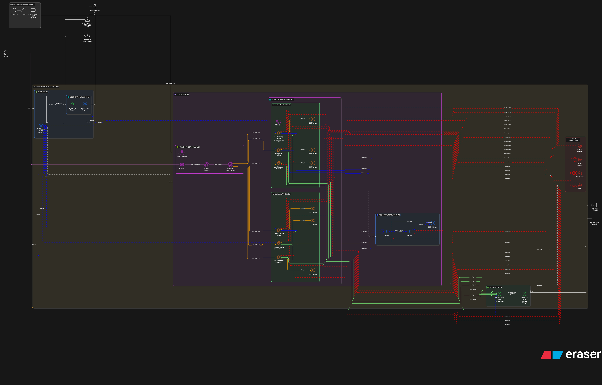

# Project 3: Enterprise Cloud Migration & Infrastructure

## Overview

This project involved migrating a hospitality business from on-premises infrastructure to AWS, including 1.5TB of SharePoint data, 6 business-critical VMs, and implementing a comprehensive disaster recovery solution with multi-region high availability.

## Business Problem

The client faced critical infrastructure and operational challenges:

**Infrastructure Limitations:**
- **Manual backups:** Backups were manual or partially automated, creating operational overhead
- **Single point of failure:** On-premises infrastructure with no disaster recovery capability
- **Limited scalability:** Hardware constraints preventing business growth
- **Data growth:** Rapidly growing to 6TB capacity driven by video and media content
- **Downtime risk:** Systems powered down when laptops closed, impacting availability
- **High costs:** ~R80,000 for current 1.5TB infrastructure including hardware and licenses

**Business Impact:**
- Multiple departments dependent on virtualized environments for daily operations
- Acceptable downtime: Website (~2 hours), Full service recovery (~3 days SLA)
- Critical systems: Access Control, CCTV, database workloads, business applications (Sage)
- Risk of data loss from hardware failure, theft, or power interruptions
- Limited business continuity capabilities

## Solution Architecture

Designed and implemented a comprehensive AWS cloud migration with high availability, disaster recovery, and scalability:

### Core Infrastructure Components

**Networking & Connectivity:**
- **Amazon VPC:** Multi-AZ architecture across primary region (Cape Town)
- **Site-to-Site VPN:** Secure connectivity between on-premises and AWS
- **Internet Gateway:** Public internet access
- **NAT Gateway:** Secure outbound connectivity for private subnets
- **Application Load Balancer:** Traffic distribution with health checks

**Compute & Applications:**
- **6 EC2 Instances** across multiple availability zones:
  - SAMS Backup Server
  - Navigation System
  - CCTV Storage Server (16 cores / 64GB RAM)
  - Business Applications (Sage ERP)
  - Access Control System
  - SMS/Communication Server
- **Multi-AZ deployment** for high availability
- **EBS Volumes:** Persistent storage for each instance

**Database:**
- **Amazon RDS PostgreSQL Multi-AZ:** High availability database with automatic failover
- **Automated backups:** Point-in-time recovery capability

**Storage Strategy:**
- **S3 Standard (4TB):** Hot storage for frequently accessed data
- **S3 Glacier (2TB):** Long-term archival for compliance and retention
- **EBS Volumes:** Block storage for application data
- **Total capacity:** 6TB including disaster recovery data

**Disaster Recovery & Backup:**
- **AWS Backup:** Centralized backup management with 30-day retention
- **Cross-region replication:** Secondary region for disaster recovery
- **Automated daily backups:** RTO < 2 hours, RPO < 24 hours
- **Lifecycle policies:** Automatic tiering to Glacier after 30 days

**Security & Management:**
- **AWS CloudWatch:** Comprehensive monitoring and alerting
- **AWS Systems Manager:** Centralized management and patching
- **AWS KMS:** Encryption key management
- **AWS Secrets Manager:** Secure credential storage
- **Route 53:** DNS management with health checks

## My Responsibilities

- Conducted comprehensive technical discovery and needs analysis
- Designed complete AWS migration architecture
- Planned multi-AZ high availability strategy
- Designed disaster recovery solution with cross-region replication
- Architected VPC network topology with public/private subnets
- Configured Site-to-Site VPN for hybrid connectivity
- Planned EC2 instance sizing and placement (16 cores / 64GB RAM for CCTV)
- Designed RDS Multi-AZ database architecture
- Implemented tiered storage strategy (S3 Standard + Glacier)
- Configured AWS Backup with 30-day retention
- Set up CloudWatch monitoring and alerting
- Implemented security best practices (KMS, Secrets Manager, IAM)
- Created cost model and technical proposal
- Documented RTO/RPO targets and SLA requirements

## Technical Implementation

### Migration Strategy
1. **Discovery Phase:** Assessed current infrastructure, data volume, and dependencies
2. **Architecture Design:** Created multi-AZ, multi-region solution
3. **Pilot Migration:** Tested with non-critical workload
4. **Data Migration:** 1.5TB SharePoint data migrated to AWS
5. **Application Migration:** 6 VMs migrated and optimized
6. **Testing:** Validated failover, backup/restore, and performance
7. **Cutover:** Phased migration with minimal downtime

### High Availability Design
- **Multi-AZ deployment:** EC2 instances across 2+ availability zones
- **Load balancing:** Application Load Balancer with health checks
- **Database failover:** RDS Multi-AZ automatic failover in minutes
- **Auto-scaling:** Configured for future growth

### Disaster Recovery Architecture
- **Primary Region:** Cape Town (af-south-1)
- **DR Region:** Secondary region for cross-region replication
- **Backup Strategy:** Daily automated backups with 30-day retention
- **Recovery Targets:**
  - RTO: < 2 hours for critical services
  - RPO: < 24 hours (daily backups)
  - Full recovery: 3-day SLA maintained

### Security Implementation
- **Network security:** Private subnets, Security Groups, NACLs
- **Encryption at rest:** KMS-managed keys for EBS, RDS, S3
- **Encryption in transit:** TLS/SSL for all connections
- **Access management:** IAM roles with least privilege
- **Credential security:** Secrets Manager for sensitive data
- **Compliance:** 30-day retention for audit requirements
- **Monitoring:** CloudWatch logs and metrics for security events

### Cost Optimization
- **Right-sizing:** Optimized EC2 instance types for workload
- **Storage tiering:** S3 Standard (4TB) + Glacier (2TB) for cost efficiency
- **Reserved capacity:** Planned for predictable workloads
- **Automated lifecycle:** Move aged data to cheaper storage tiers
- **Cross-region strategy:** Balance cost vs. resilience

## Outcome / Results

- ✅ **Successfully migrated 1.5TB of SharePoint data** to AWS with zero data loss
- ✅ **Deployed 6 production VMs** with high availability across multiple AZs
- ✅ **Achieved RTO < 2 hours** for critical services vs. 3-day SLA
- ✅ **Implemented 30-day backup retention** with automated daily backups
- ✅ **Eliminated single point of failure** with multi-AZ and cross-region DR
- ✅ **Enabled scalability to 6TB** with room for future growth
- ✅ **Reduced operational overhead** through automation and managed services
- ✅ **Improved security posture** with encryption, monitoring, and access controls
- ✅ **Maintained business continuity** with Site-to-Site VPN during migration
- ✅ **Cost predictability** with usage-based pricing model

## Architecture Diagram

## Technical Challenges Overcome

1. **Hybrid Connectivity:** Implemented Site-to-Site VPN for seamless on-premises integration
2. **CCTV Storage Requirements:** Designed high-performance solution (16 cores / 64GB RAM)
3. **Data Migration:** Successfully moved 1.5TB with minimal downtime
4. **Multi-system Integration:** Connected Access Control, CCTV, and business applications
5. **Cost Management:** Balanced performance requirements with budget constraints
6. **Recovery Time:** Exceeded client expectations with < 2 hour RTO vs. 3-day SLA

## Lessons Learned

- Thorough discovery phase is critical for successful cloud migrations
- Multi-AZ deployments provide significant resilience with minimal cost increase
- Automated backups eliminate human error and ensure consistency
- Site-to-Site VPN enables phased migration with minimal disruption
- Storage tiering (Standard + Glacier) dramatically reduces long-term costs
- CloudWatch and Systems Manager simplify operational management
- RDS Multi-AZ provides database reliability without operational overhead
- Planning for 6TB capacity (vs. current 1.5TB) prevents future re-architecture

## Technologies & AWS Services Used

**Compute:** Amazon EC2 (6 instances, multi-AZ)  
**Networking:** VPC, Site-to-Site VPN, Internet Gateway, NAT Gateway, Route 53  
**Load Balancing:** Application Load Balancer  
**Database:** Amazon RDS PostgreSQL Multi-AZ  
**Storage:** Amazon S3 (Standard, Glacier), EBS Volumes  
**Backup & DR:** AWS Backup, Cross-region replication  
**Security:** KMS, Secrets Manager, IAM, Security Groups  
**Monitoring & Management:** CloudWatch, Systems Manager  
**Migration:** AWS Migration Hub, DataSync

## Business Value

**Before Migration:**
- Manual backups with human error risk
- No disaster recovery capability
- Limited to 1.5TB capacity
- Single point of failure
- 3-day recovery SLA
- High capital costs (R80,000)

**After Migration:**
- Automated daily backups (30-day retention)
- Multi-region disaster recovery
- Scalable to 6TB+ capacity
- Multi-AZ high availability
- < 2 hour recovery time (exceeded SLA)
- Predictable operational costs
