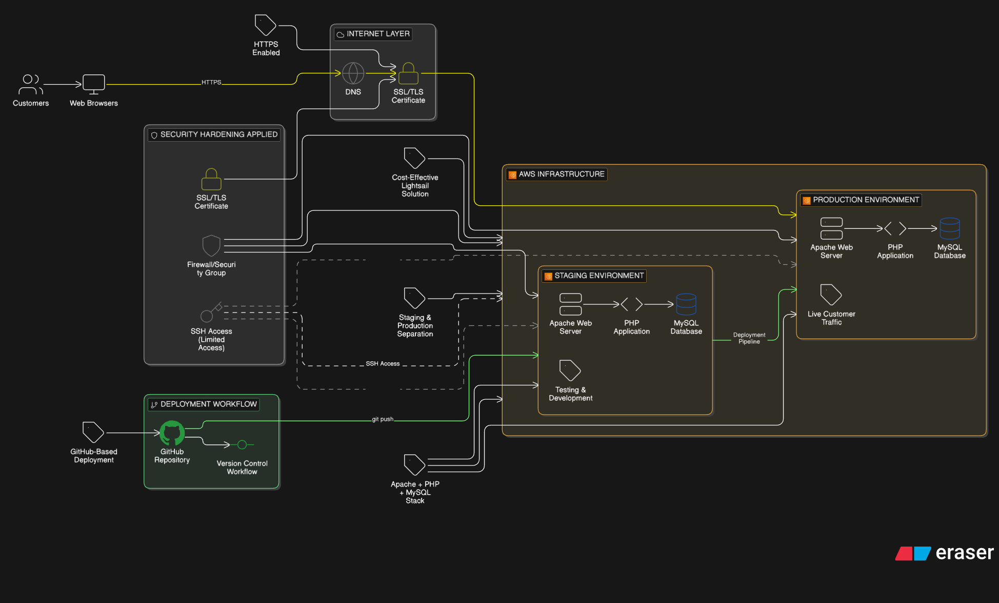

# Project 1: AWS Lightsail E-commerce Website

## Overview

This project involved deploying and managing a dynamic PHP-based e-commerce website on AWS Lightsail for a real client.

## Business Problem

The client needed a cost-effective, reliable online platform to showcase products and handle customer interactions without managing on-premise infrastructure.

## Solution Architecture

- **AWS Lightsail** (Compute)
- **Apache Web Server**
- **PHP Application**
- **MySQL Database**
- **SSL Certificate** (HTTPS)
- **GitHub Actions** for CI/CD automation

## My Responsibilities

- Provisioned and configured AWS Lightsail instances
- Deployed PHP application
- Configured Apache virtual hosts
- Managed SSL certificates
- Set up staging and production environments
- Implemented GitHub Actions-based deployment workflow
- Troubleshot networking, DNS, and permissions issues

## Security Considerations

- HTTPS enabled using SSL
- Limited server access via SSH
- Basic server hardening
- Separation of staging and production environments

## Outcome / Results

- Successfully deployed a live e-commerce website
- Improved reliability and availability
- Client received a production-ready cloud-hosted solution
- Automated deployment pipeline reduced manual errors

## Architecture Diagram

## Lessons Learned

- Practical AWS Lightsail management
- Real-world deployment challenges
- Importance of staging environments
- CI/CD automation with GitHub Actions
- Cost-effective cloud hosting for small businesses

## Technologies Used

**Platform:** AWS Lightsail  
**Web Server:** Apache  
**Application:** PHP  
**Database:** MySQL  
**Security:** SSL/HTTPS  
**CI/CD:** GitHub Actions  
**Version Control:** Git/GitHub
